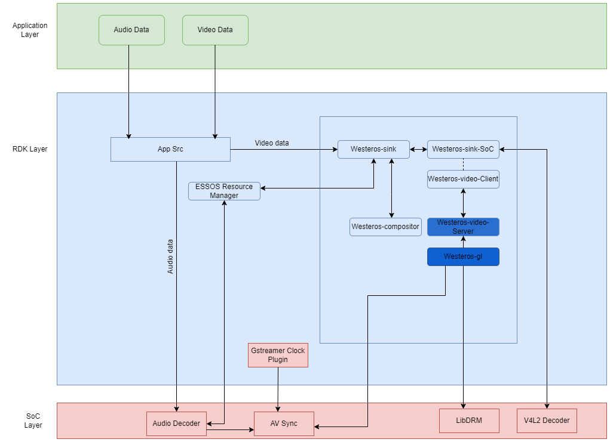

@mainpage

# RDK Component AV HAL Documentation

## Version History
| Date | Author | Comment | Version |
| --- | --------- | --- | --- |
| 27/06/23 | Premium App Team | First Release | 1.0.0 |
| 23/05/23 | Review Team | First Edit | 0.1.1 |
| 08/05/23 | Premium App Team | Pre-Release | 0.1.0 |

## Table of Contents
- [Overview](#overview)
- [Architecture](#architecture)
- [Video Playback Pseudo Code](#video-playback-pseudo-code)
- [References](#references)

## Overview
This is the API Interface Documentation for AV Subsystem HAL in RDK. The sub-components for this subsystem is mentioned further along with the header files that needs to be referred by SoC teams for their implementation. 

This subsystem allows applications to render audio and video (includes drawing video frames, playing audio streams, and managing the playback of audio and video streams), buffer management (includes allocating buffers, managing buffer lifetimes, and transferring buffers between the application and the compositor) and synchronization (includes synchronizing video and audio frames, and synchronizing video and audio streams). The AV Subsystem plays a vital role in ensuring a smooth playback.

### Sub-components documentation:

Refer Documentation: https://github.com/rdkcentral/westeros-halif/tree/rdk-dev/docs/pages 

1. <a href="md_pages_2westeros-compositor.html">westeros-compositor</a> : https://github.com/rdkcentral/westeros-halif/blob/rdk-dev/docs/pages/westeros-compositor.md 
2. <a href="md_pages_2westeros-renderer.html">westeros-renderer</a> : https://github.com/rdkcentral/westeros-halif/blob/rdk-dev/docs/pages/westeros-renderer.md 
3. <a href="md_pages_2westeros-sink-soc.html">westeros-sink-soc</a> : https://github.com/rdkcentral/westeros-halif/blob/rdk-dev/docs/pages/westeros-sink-soc.md 
4. <a href="md_pages_2av-sync.html">av-sync</a> : https://github.com/rdkcentral/westeros-halif/blob/rdk-dev/docs/pages/av-sync.md   

### Header Files:

Refer <a href="files.html">Files</a>: https://github.com/rdkcentral/westeros-halif/tree/rdk-dev/include 

RDK:
1. <a href="westeros-compositor_8h.html">westeros-compositor.h</a> : https://github.com/rdkcentral/westeros-halif/blob/rdk-dev/include/RDK/westeros-compositor.h 
2. <a href="westeros-render_8h.html">westeros-render.h</a> : https://github.com/rdkcentral/westeros-halif/blob/rdk-dev/include/RDK/westeros-render.h 
3. <a href="westeros-sink_8h.html">westeros-sink.h</a> : https://github.com/rdkcentral/westeros-halif/blob/rdk-dev/include/RDK/westeros-sink.h 
4. <a href="westeros-gl_8h.html">westeros-gl.h</a> : https://github.com/rdkcentral/westeros-halif/blob/rdk-dev/include/RDK/westeros-gl.h

SoC:
1. <a href="westeros-sink-soc_8h.html">westeros-sink-soc.h</a> : https://github.com/rdkcentral/westeros-halif/blob/rdk-dev/include/SoC/westeros-sink-soc.h 
2. <a href="av-sync_8h.html">avsync.h</a> : https://github.com/rdkcentral/westeros-halif/blob/rdk-dev/include/SoC/avsync.h 

## Architecture

This is the high-level overview of the Audio Video Subsystem. 

 

## Video Playback Pseudo Code

- Step 1: As the system boots up westeros-gl (libwesteros_gl.so) will be responsible for creating the graphics UI. In our case since ResidentApp is responsible for bringing up the main GUI, a wayland display is created for ResidentApp (displayName=ResidentApp/wst-ResidentApp) and renderer module (libwesteros_render_embedded.so.0) is loaded and initialized. As per the Wayland communication protocol a server (Westeros Video Server) is initiated from the function wstInitServiceServer and it will wait for a client (Westeros Video Client) to be attached.   

- Step 2: As the system plugins are initiated, during activation of PlayerInfo plugin, GStreamer is initiated, and it loads the plugin for V4L2 (libgstvideo4linux2.so).

- Step 3: After successful activation of RDK Shell, Essos resource manager collects the available capabilities of the available resources - (config file defines 2 video decoders 1 audio decoders 1 frontends 1 svpa) and during the following stages when any of these resources are requested it allocates it based on priority. 

- Step 4: When an App is launched, a wayland display is created specific to that App with displayName=<AppName/wst-AppName> and renderer is loaded and initialized. 

- Step 5: Video data from gst pipeline is fed into the westeros-sink module, and it will further be processed in the westeros-sink-soc module. The westeros-sink-soc module is responsible largely for communicating with the V4L2 driver over IOCTL commands. westeros-sink-soc module also acts as the Westeros Video Client and communicates with the Westeros Video Server. 

- Step 6: Supported Resolution and current resolutions are fetched and Client sends the video frames with its details to the server in the message "VSAF" (frameWidth, frameHeight, frameFormat, rectX, rectY, rectW, rectH, offset0, stride0, offset1, stride1, offset2, stride2, bufferId, frameTime) and the messages related to frame status ("VS13S") and release buffer ("VS5B") are send from the server.
   - With the ‘S’ (VSAS) message client receives information about frameTime, position and PTS. 
   - westerossink westeros-sink-soc.c:wstProcessMessagesVideoClientConnection: receive frameTime: 3360000000 position 3360000000 PTS 302403
   - westerossink westeros-sink-soc.c: gst_westeros_sink_soc_get_frame_drop_num: dropped 0 displayed 72 

- Step 7:Following are the state changes in westeros during a playback:
   - NULL to READY 
     During this time, westeros sink request Essos manager to allocates audio and video decoders and based on the priority and availability, decoders will be allocated. 
   - READY to PAUSED 
     Subscribe to source change and EOS events from the driver and a socket client is initiated for the selected app.  
   - PAUSED to PLAYING 
     Video states are updated to play from pause. 
   - PLAYING to PAUSED 
     During video pre-rolling data is queued in the buffer. Client and server server communicates over the socket. 
   - PAUSED to READY 
     Video client connection is terminated with a Shutdown command. 
   - READY to NULL 
     All resources are cleaned up.

### Essos Resource Manager 

When gstreamer pipeline state changes from NULL to READY, it should acquire resources such as video decoder and audio decoder. The required process/instance uses Essos APIs to request decoders with the specified priority and usage. Below is the pseudocode - 

- //state change call back to westeros-sink 
- gst_westeros_sink_change_state() 
- case GST_STATE_CHANGE_NULL_TO_READY 
- //Creates a resource manager context 
- EssRMgrCreate() 
- //Copy required sink properties to request parameter to pass in EssRMgrRequestResource function 
- //Request resource with specified priority and usage 
- EssRMgrRequestResource() 
- //Wait for ESSRMgrEvent_granted event from ERM 
- //Acquire resource

### LibDRM 

- LibDRM  is a kernel subsystem in Linux that provides support for rendering graphics and managing display devices. It is responsible for interacting with the graphics hardware and providing direct access to it. It enables hardware acceleration for video decoding and rendering. During video playback, the client application (like a media player) running on top of the Wayland protocol communicates with the westeros-compositor. The compositor, in turn, utilizes the capabilities of this drm subsystem to facilitate efficient video rendering and display. 

- LibDRM APIs are mainly called from the westeros-gl part during playback. 

### AV Sync 

- SoC vendor needs to implement gst_clock_init() that takes audioclock "clock" as an input so that session can be created. This function is supposed to call av_sync_open_session(). 
- gstreamer-clock-plugin is only responsible for calling av_sync_open_session & av_sync_close_session, rest of the other av_sync api's are being called from westeros side (westeros-gl -> avsync.c) 
- State change happens (confirmed by gst_westeros_sink_change_state) happens during playback. We can see av_sync_push_frame & av_sync_pop_frame being called consecutively and successively 

## References 
1. [API Interface Documentation for AV Subsystem in RDK](https://wiki.rdkcentral.com/pages/viewpage.action?spaceKey=ASP&title=API+Interface+Documentation+for+AV+Subsystem+in+RDK)
2. [Westeros - RDK - RDK Central Wiki](https://wiki.rdkcentral.com/display/RDK/Westeros)
3. [v4l2-test-formats.cpp](https://git.linuxtv.org/v4l-utils.git/tree/utils/v4l2-compliance/v4l2-test-formats.cpp)
4. [components/opensource/westeros](https://code.rdkcentral.com/r/admin/repos/components/opensource/westeros,general)
