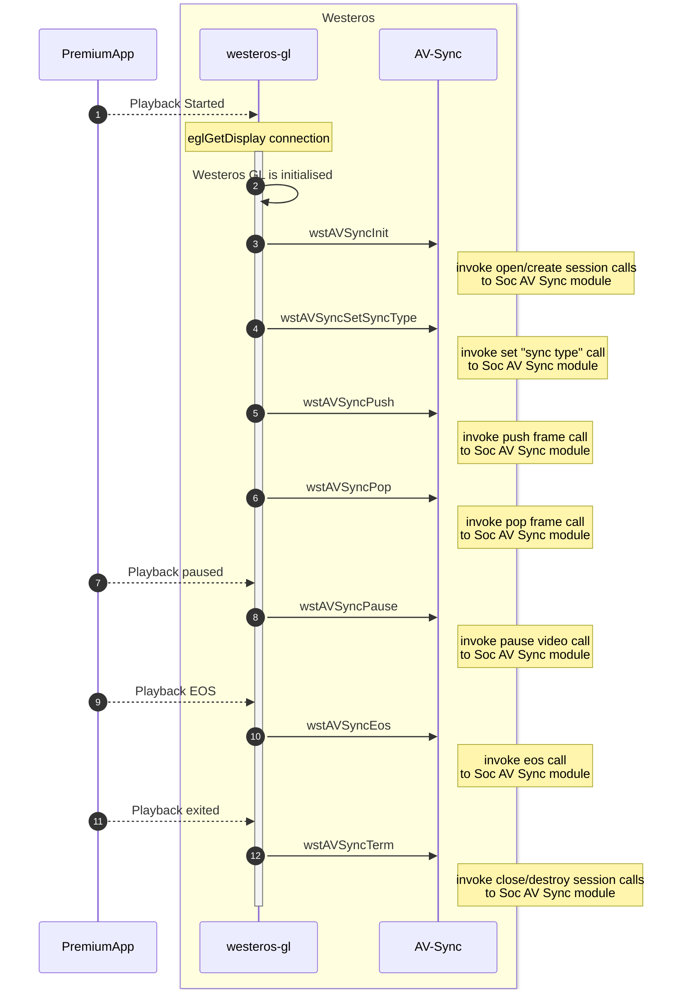

# AV Sync Documentation

## Version History

| Date | Author | Comment | Version |
| --- | --------- | --- | --- |
| 29/07/23 | Premium App Team | First Release | 1.1.1 |
| 23/05/23 | Review Team | First Edit | 0.1.1 |
| 08/05/23 | Premium App Team | Pre-Release | 0.1.0 |

## Table of Contents

- [Description](#description)
  - [Introduction](#introduction)
  - [Repo Details](#repo-details)
  - [Acronyms, Terms and Abbreviations](#acronyms-terms-and-abbreviations)
  - [References](#references)
- [Component Runtime Execution Requirements](#component-runtime-execution-requirements)
  - [Initialization and Startup](#initializatio-and-startup)
  - [Threading Model](#threading-model)
  - [Process Model](#process-model)
  - [Memory Model](#memory-model)
  - [Power Management Requirements](#power-management-requirements)
  - [Asynchronous Notification Model](#asynchronous-notification-model)
  - [Blocking calls](#blocking-calls)
  - [Internal Error Handling](#internal-error-handling)
  - [Persistence Model](#persistence-model)
- [Non-functional requirements](#non-functional-requirements)
  - [Logging and debugging requirements](#logging-and-debugging-requirements)
  - [Memory and performance requirements](#memory-and-performance-requirements)
  - [Quality Control](#quality-control)
  - [Licensing](#licensing)
  - [Build Requirements](#build-requirements)
  - [Variability Management](#variability-management)
  - [Platform or Product Customization](#platform-or-product-customization)
- [Interface API Documentation](#interface-api-documentation)
  - [Theory of operation and key concepts](#theory-of-operation-and-key-concepts)
  - [Diagrams](#diagrams)
    - [AVSync Code flow](#avsync-code-flow)
  - [Data Structures and Defines](#data-structures-and-defines)

## Description

### Introduction

AV sync module is a software component that enables synchronization between audio and video signals in real-time media applications. This module is particularly important in media playback scenarios where the audio and video streams faces synchronization issues.
The AV sync module in Westeros is responsible for ensuring that audio and video components are properly synchronized during playback. When video streams are received by Westeros, they are passed to the AV sync module, which checks for timing differences between the video and audio components. If there is a timing difference, the AV sync module will adjust the playback speed of the audio or video components, add or remove frames, or use buffering and interpolation to smooth out any timing differences and ensure that the audio and video components are properly synchronized. This process helps to prevent any lip sync issues or other synchronization problems that can occur during video playback.

### Repo Details
| Module  | RDK repo | Filepath/Filename  |
| --- | --- | --- |
| AV sync | https://code.rdkcentral.com/r/components/opensource/westeros |  file: drm/westeros-gl/avsync/avsync.h |

### Acronyms, Terms and Abbreviations

- `AV Sync`      - Audio Video Synchronization
- `HAL`          - Hardware Abstraction Layer
- `API`          - Application Programming Interface
- `Caller`       - Any user of the interface via the APIs
- `wst`          - Westeros
- `Westeros-gl`  - Westeros Graphics Library
- `EGL`          - Embedded Graphics Library

### References
[API Interface Documentation for AV Subsystem in RDK](https://wiki.rdkcentral.com/pages/viewpage.action?spaceKey=ASP&title=API+Interface+Documentation+for+AV+Subsystem+in+RDK) \n

## Component Runtime Execution Requirements

These requirements ensure that the HAL executes correctly within the run-time environment that it will be used in.

The requirements for AV sync module includes ensuring that the chipsets have sufficient processing power, low latency, accurate clock synchronization, and support for multiple media formats to enable smooth and reliable audio and video synchronization in real-time media application:

### Initialization and Startup

The initialization and startup process for AV sync module would typically involves detecting and synchronizing the incoming audio and video streams, managing buffers to prevent data loss, and integrating the AV sync module with the media playback pipeline to ensure smooth playback:

1. Detection of audio and video streams: The AV sync module must detect the incoming audio and video streams and extract timing information from each stream.

2. Calculation of initial synchronization offset: Based on the timing information extracted from the audio and video streams, the AV sync module calculates an initial synchronization offset between the two streams.

3. Adjustment of synchronization offset: Once the initial synchronization offset has been calculated, the AV sync module continuously monitors the audio and video streams and adjusts the synchronization offset as needed to maintain synchronization.

4. Buffer management: The AV sync module uses buffers to manage the incoming audio and video data. SoC vendors need to ensure that their chipsets have sufficient buffer capacity to handle the data flow and prevent buffer underflow or overflow.

5. Integration with media playback pipeline: The AV sync module needs to be integrated with the media playback pipeline to ensure that the synchronized audio and video streams are properly rendered. SoC vendors need to ensure that their chipsets support the necessary APIs and interfaces for this integration.

Caller is supposed to call wstAVSyncInit() before any other calls to hit the av sync module from Westeros.

### Threading Model

This interface is not required to be thread safe. Any caller invoking the APIs should ensure calls are made in a thread safe manner.
wstAVSyncTerm() function will clean up and terminate the AV sync module used for video playback that was previously initialized by wstAVSyncInit and any repsective threads.
The threading model can provide real-time performance with minimal latency to prevent synchronization errors. The AV sync module may require multiple threads to handle different tasks such as data input/output, buffer management, and synchronization calculations to enable efficient processing of the audio and video data. The threads used by the AV sync module must be synchronized to ensure that they operate in a coordinated manner and do not interfere with each other and support efficient thread synchronization to prevent synchronization errors or deadlocks.
Overall, the threading model for AV sync module for SoC vendors involves ensuring real-time performance, multi-threading support, efficient thread synchronization, and power efficiency to enable smooth and reliable audio and video synchronization in real-time media applications.

### Process Model

The interface is expected to support a single instantiation with a single process.
The process model for this module can include considerations like ensuring high execution priority to ensure that it operates in real-time and maintains synchronization between audio and video streams to prevent delays and maintain smooth playback, efficient resource allocation to certain hardware resources such as audio and video decoders, clocks, memory to ensure that the AV sync module process has the necessary access to these resources to enable efficient processing of the audio and video data and also robust error handling to enable reliable audio and video synchronization during playback scenarios. Also, the implementation must be able to handle errors such as buffer overflows, synchronization errors, and resource allocation failures. SoC vendors need to ensure that the AV sync module process has robust error handling mechanisms to prevent system crashes and ensure reliable operation.

### Memory Model

The Caller will own any memory that it creates after calling the API's.
The memory model for AV sync module involves ensuring sufficient memory allocation (to store audio and video data, synchronization information, and other variables used during processing), efficient memory management mechanism (to manage memory usage to prevent buffer overflows and underflows, and ensure that the data is processed in a timely manner) and cache management (requires access to certain memory locations frequently during processing to optimize the AV sync module's access to memory and improve performance) to enable smooth and reliable audio and video synchronization during different playback cases.

### Power Management Requirements

Although this interface is not required to be involved in any of the power management operations, the state transitions should not affect its operation. e.g. on resumption from a low power state, the interface should operate as if no transition has occurred. The power management requirements for AV sync module for SoC vendors involve ensuring power efficiency (optimize by minimizing CPU and memory usage, reducing unnecessary processing, and maximizing idle time), support for DVFS (Dynamic Frequency and Voltage Scaling to adjust the processing speed and power consumption according to the workload requirements), low power modes (such as sleep or standby to reduce power consumption during idle or low activity periods ) and efficient thermal management (prevent overheating and ensure reliable operation under varying thermal conditions) to ensure reliable operation of the AV sync module.

### Asynchronous Notification Model

The Asynchronous Notification Model requirements can involve ensuring support for asynchronous notification, event-driven processing, callback functions, and thread safety mechanisms to enable efficient processing of audio and video data and communication between the AV sync module and other components:

1. Asynchronous notification: The AV sync module can support asynchronous notification to enable efficient processing of audio and video data. SoC vendors need to ensure that their chipsets support the asynchronous notification model to enable efficient communication between the AV sync module and other components.

2. Event-driven processing: The AV sync module should be designed with an event-driven processing model to enable efficient handling of events such as new audio or video data arriving. SoC vendors need to ensure that their chipsets support the event-driven processing model to enable efficient processing of audio and video data.

3. Callback functions: The AV sync module may require the use of callback functions to enable efficient handling of events. SoC vendors need to ensure that their chipsets support the use of callback functions to enable efficient communication between the AV sync module and other components.

4. Thread safety: The AV sync module should be designed to ensure thread safety when using the asynchronous notification model. SoC vendors need to ensure that their chipsets support thread safety mechanisms such as mutexes and semaphores to prevent synchronization errors and deadlocks.

### Blocking calls

The blocking calls requirements may involve ensuring support for blocking calls, thread safety mechanisms, managing performance implications, and exploring alternative communication mechanisms to optimize the performance of the AV sync module. The use of blocking calls may not always be the most efficient or appropriate mechanism for communication between the AV sync module and other components. Other alternative mechanisms such as non-blocking calls or event-driven processing to optimize the performance of the AV sync module can be explored.

### Internal Error Handling

All the APIs must return error synchronously as a return argument. HAL is responsible for handling system errors (e.g. out of memory) internally.
The AV sync module should be designed to detect errors or exceptions that occur during processing for precise error handling. Error handling mechanisms such as error logging, error reporting, or error recovery can be implemented for debugging and troubleshooting purposes. Also, this module should be designed to ensure robustness in the face of errors or unexpected conditions. 

### Persistence Model

There is no requirement for the interface to persist any setting information however, this module may require storage to persist data such as synchronization information, buffer contents or any configuration. Enough storage capacity and efficient storage mechanisms to support the AV sync module's persistence requirements can be ensured. Also data integrity mechanisms such as error correction codes and checksums to prevent data loss or corruption should be considered as well for smooth playback operations.

## Non-functional requirements

### Logging and debugging requirements

This interface is required to support TRACE, DEBUG, INFO, WARN and ERROR messages. DEBUG should be disabled by default and enabled when required. ERROR and WARN level logs should be enabled. The module should support logging of relevant events and errors to enable troubleshooting and sufficient debugging and performance monitoring information can be provided such as stack traces, error messages, and variable values. SoC vendors need to ensure that the AV sync module supports logging to a system log or a dedicated log file.

### Memory and performance requirements

This interface is required to not cause excessive memory and CPU utilization. The requirements for AV sync module should provide optimal memory capacity and bandwidth, efficient processing power, caching mechanisms, and power efficiency to enable smooth and reliable audio and video synchronization in real-time media applications. The AV sync module may require memory to store audio and video data, synchronization information and other variables used during processing and maintain synchronization in real-time. SoC vendors need to ensure that their chipsets have sufficient memory capacity to support the AV sync module's memory and perfomance requirements.

### Quality Control

- This interface is required to perform static analysis, our preferred tool is Coverity.
- Open-source copyright validation is required to be performed, e.g.: Black duck, FossID.
- Have a zero-warning policy with regards to compiling. All warnings are required to be treated as errors.
- Use of memory analysis tools like Valgrind are encouraged, to identify leaks/corruptions.
- Tests will endeavour to create worst case scenarios to assist investigations.

### Licensing

The `HAL` implementation is expected to released under the Apache License 2.0.

### Build Requirements

The build requirements for AV sync module for SoC vendors involves ensuring:
1. compatibility with the build process/configurations used by the RDK and native Premium apps
2. inclusion of all necessary dependencies on other software components and libraries 
3. support for testing mechanisms during the build process to ensure that the AV sync module is functioning properly. 

### Variability Management

Any changes in the `Public APIs` should be reviewed and approved by the component architects. The AV sync module may require version management to enable maintenance and updates. 

### Platform or Product Customization

The platform or product customization requirements for AV sync module for SoC vendors includes ensuring support for native premium apps integration, customization options, platform-specific/product-specific features, along with the provision of sufficient documentation to enable adequate customization and implementation of the AV sync module.

## Interface API Documentation

`API` documentation will be provided by Doxygen which will be generated from the header files.

### Theory of operation and key concepts

The Westeros module and the AVSync module work together to provide audio and video synchronization for video playback on Linux systems. The Westeros module is responsible for video playback and rendering using the Wayland protocol. It uses the Westeros-GL module to perform graphics rendering and the AVSync module to synchronize the audio and video components of a multimedia stream. The AVSync module provides audio and video synchronization by performing timing calculations and adjusting the playback rate of the audio stream to match the video stream. 

The Westeros-gl module initializes with the WstGLInit() call which further goes on to start the video server connection through internal calls. These internal calls will lead to the Westeros AV sync calls under different playback conditions. The Westeros AV sync calls are responsible for calling the SoC specific AV Sync Module and their respective API's which needs to provide low-level synchronization operations by making ioctl calls for handling synchronization-related operations by making use of a device file to communicate with the hardware and perform them.
These Westeros AV Sync calls are:

1. wstAVSyncInit: This API is only called if the WESTEROS_GL_AVSYNC macro is defined. The purpose of the wstAVSyncInit function is to initialize the audio and video synchronization. The function should be called when the syncType is not SYNC_IMMEDIATE and the VideoFrameManager syncInit flag is not set. These conditions ensure that the synchronization is only initialized when necessary, and not on every frame. If both conditions are true, then the wstAVSyncInit function is called with two arguments: vfm and vfm->conn->sessionId. The vfm argument is a pointer to the VideoFrameManager object, and the vfm->conn->sessionId argument is an identifier for the current session. The calling funtion for wstAVSyncInit checks if the conn->videoPlane->vfm object exists. The vfm object is a VideoFrameManager object that is responsible for managing the video frames. If vfm exists, then the code checks if the syncInit flag is false and if the syncType is not SYNC_IMMEDIATE.

2. wstAVSyncTerm: This API is only called if the WESTEROS_GL_AVSYNC macro is defined. The function should be called when the synchronization process is no longer needed or when the application is shutting down. 

3. wstAVSyncSetSyncType: This API is only called if the WESTEROS_GL_AVSYNC macro is defined and the vfm->sync member is not NULL. The function should be called when the synchronization mode needs to be changed.

4. wstAVSyncPush: This API is called based on the preprocessor directive #ifdef WESTEROS_GL_AVSYNC and the audio-video synchronization resources are available, the function checks if syncInit member is false and the syncType member is not SYNC_IMMEDIATE. If both conditions are true, the function initializes audio-video synchronization resources using the wstAVSyncInit function. After initialization, the function calls the wstAVSyncPush function with the vfm object and the f parameter, which is a pointer to the VideoFrame structure containing the video frame data.

5. wstAVSyncPop: This API is called based on the preprocessor directive #ifdef WESTEROS_GL_AVSYNC and if vfm is not expired, then it checks if video playback is not paused. If playback is paused, there is no need to call wstAVSyncPop as there will be no new frames to display.

6. wstAVSyncPause: This API is only called if the WESTEROS_GL_AVSYNC macro is defined and checks if viideo playback is currently paused (vfm->paused is true), and the pause argument is false (i.e. playback is being resumed), and the vfm->resetBaseTime variable is also true, then the function resets the vfm->flipTimeBase variable to 0 and sets resetBaseTime to false. The flipTimeBase variable is used to keep track of the time that the last video frame was displayed, and the resetBaseTime variable is used to indicate whether or not this variable needs to be reset. This ensures that when playback is resumed, the next video frame will be displayed at the correct time.

7. wstAVSyncEos: This API is only called if the WESTEROS_GL_AVSYNC macro is defined and if vmf->sync is true.

### Diagrams

#### AV Sync Code Flow

### Data Structures and Defines
Refer the 'Files' sections: <a href="files.html">Files</a>
- SoC vendors should refer to the header files under the 'soc' directory for API implementation.
- For RDK level implementation refer to the header files under the 'rdk' directory.
