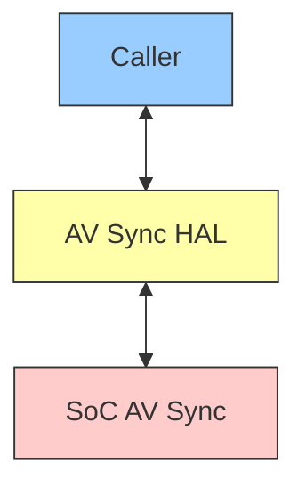
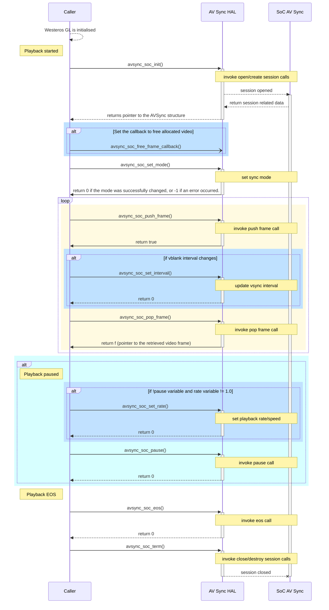

# AV Sync Documentation

## Version History

| Date [DD/MM/YY] | Comment | Version |
| --- | --- | --- |
| /08/23 | Initial review fixes	| 1.0.1 |
| 29/07/23 | First Release | 1.0.0 |

## Table of Contents

- [Description](#description)
  - [Introduction](#introduction)
  - [Acronyms, Terms and Abbreviations](#acronyms-terms-and-abbreviations)
- [Component Runtime Execution Requirements](#component-runtime-execution-requirements)
  - [Initialization and Startup](#initializatio-and-startup)
  - [Threading Model](#threading-model)
  - [Process Model](#process-model)
  - [Memory Model](#memory-model)
  - [Power Management Requirements](#power-management-requirements)
  - [Asynchronous Notification Model](#asynchronous-notification-model)
  - [Blocking calls](#blocking-calls)
  - [Internal Error Handling](#internal-error-handling)
  - [Persistence Model](#persistence-model)
- [Non-functional requirements](#non-functional-requirements)
  - [Logging and debugging requirements](#logging-and-debugging-requirements)
  - [Memory and performance requirements](#memory-and-performance-requirements)
  - [Quality Control](#quality-control)
  - [Licensing](#licensing)
  - [Build Requirements](#build-requirements)
  - [Variability Management](#variability-management)
  - [Platform or Product Customization](#platform-or-product-customization)
- [Interface API Documentation](#interface-api-documentation)
  - [Theory of operation and key concepts](#theory-of-operation-and-key-concepts)
  - [Diagrams](#diagrams)
    - [AVSync Code flow](#avsync-code-flow)
  - [Data Structures and Defines](#data-structures-and-defines)

## Description
This interface is to abstract the `RDK`-V `AV Sync` `HAL` requirements at a general level to allow platform independent control. `AV Sync` `HAL` provides details on a set of `API`'s for `SoC` implementation. The picture below shows the interactions between `Caller`, `AV Sync` `HAL` and `SoC` `AV Sync`.

### Introduction
`AV Sync` module is a software component that enables synchronization between audio and video signals in real-time media applications. This module is particularly important in media playback scenarios where the audio and video streams faces synchronization issues.

### Acronyms, Terms and Abbreviations

- `AV Sync`      - Audio Video Synchronization
- `HAL`          - Hardware Abstraction Layer
- `API`          - Application Programming Interface
- `RDK`          - Reference Design Kit for All Devices
- `Caller`       - Any user of the interface via the APIs
- `SoC`          - System on Chip
- `Westeros-GL`  - Westeros Graphics Library

## Component Runtime Execution Requirements
These requirements ensure that the `HAL` executes correctly within the run-time environment that it will be used in.Failure to meet these requirements will likely result in undefined and unexpected behaviour.

### Initialization and Startup
`Caller` should initialize the `AV Sync` session by calling `avsync_soc_init`() before calling any other `API`.

### Threading Model
This interface is not required to be thread safe. Any `Caller` while invoking these HAL `API`'s should ensure calls are made in a thread safe manner.

### Process Model
The interface is expected to support a single instantiation with a single process.

### Memory Model
The `AV Sync` `HAL` will own any memory that it creates. The `Caller` will own any memory that it creates.

The `avsync_soc_push_frame`() is responsible to allocate memory for video frames but it should also free this memory if in case sync push frame operation fails.

### Power Management Requirements
This interface is not required to be involved in power management.

### Asynchronous Notification Model
`avsync_soc_free_frame_callback()` function sets the callback function for freeing any allocated video frames. 

### Blocking calls
This interface is required to have no blocking calls.

### Internal Error Handling
All the `API`'s must return error synchronously as a return argument. `HAL` is responsible for handling system errors (e.g. out of memory) internally.

### Persistence Model
There is no requirement for the interface to persist any setting information.

## Non-functional requirements

### Logging and debugging requirements
This interface is required to support DEBUG, INFO and ERROR messages. ERROR logs should be enabled by default. DEBUG and INFO is required to be disabled by default and enabled when needed.

### Memory and performance requirements
This interface is required to not cause excessive memory and CPU utilization. 

### Quality Control
- This interface is required to perform static analysis, our preferred tool is Coverity.
- Have a zero-warning policy with regards to compiling. All warnings are required to be treated as error.
- Copyright validation is required to be performed, e.g.: Black duck, FossID.
- Use of memory analysis tools like Valgrind are encouraged, to identify leaks/corruptions.
- `HAL` Tests will endeavour to create worst case scenarios to assist investigations.
- Improvements by any party to the testing suite are required to be fed back.

### Licensing
The `HAL` implementation is expected to released under the Apache License 2.0.

### Build Requirements
The source code must build into a shared library and must be named as libXavsync.so where X denotes the `SoC` `AV Sync` module. The build mechanism must be independent of Yocto. 

### Variability Management
Any change to the interface must be reviewed and approved by component architects and owners.

### Platform or Product Customization
The requirements for `AV Sync` module for `SoC` vendors includes ensuring support for native premium apps integration, customization options, platform-specific/product-specific features, along with the provision of sufficient documentation to enable adequate customization and implementation of the `AV Sync` module.

## Interface API Documentation
`API` documentation will be provided by Doxygen which will be generated from the header files.

### Theory of operation and key concepts
The `Caller` is expected to have complete control over the life cycle of the `HAL`.

- The Westeros module and the `AV Sync` module work together to provide audio and video synchronization for video playback on Linux systems. The Westeros module is responsible for video playback and rendering using the Wayland protocol. It uses the `Westeros-GL` module to perform graphics rendering and the AVSync module to synchronize the audio and video components of a multimedia stream. 

- After the `Westeros-GL` module is initialized, a video server connection is setup through the internal calls. These internal calls will further lead to the start of `AV Sync` module. The Westeros `AV sync` calls will be calling the `HAL` `API`'s, which would be responsible to call the respective `SoC` specific `AV Sync` API's, that would further handle the low-level synchronization related operations using ioctl calls.

- The `HAL` `AV Sync` `API`'s are: 

`avsync_soc_init`(), `avsync_soc_term`(), `avsync_soc_set_mode`(), `avsync_soc_free_frame_callback`(), `avsync_soc_push_frame`(), `avsync_soc_pop_frame`(), `avsync_soc_set_rate`(), `avsync_soc_pause`(), `avsync_soc_set_interval`(), `avsync_soc_eos`().

- Initialize the `HAL` using function `avsync_soc_init`() before making any other `API`s calls. If this call fails, the `HAL` must return the respective error. This call initializes the `AV Sync` session and should provide required session related data such as refresh rate, seesion id, sync type, and other optional data like start threshold, vsync interval etc.

- The `avsync_soc_free_frame_callback`() function sets the callback function for freeing any allocated video frames. 

- The push and pop operations on the video frames to `AV Sync` module will be done using `avsync_soc_push_frame`() and `avsync_soc_pop_frame` respectively.

- The sync mode, playback rate and vsync interval can be set using `avsync_soc_set_mode`(), `avsync_soc_set_rate`() and `avsync_soc_set_interval`() respectively.

- The `avsync_soc_pause`() and `avsync_soc_eos`() should handle the playback conditions 'pause' and 'end-of-stream' respectively.

- The `AV Sync` session will be terminated using `avsync_soc_term`() `API`.

### Diagrams

#### AV Sync Code Flow

### Data Structures and Defines
`SoC` vendors should refer to the header files under the 'include' directory for `API` implementation: https://github.com/rdkcentral/avsync-halif/blob/rdk-dev/include/