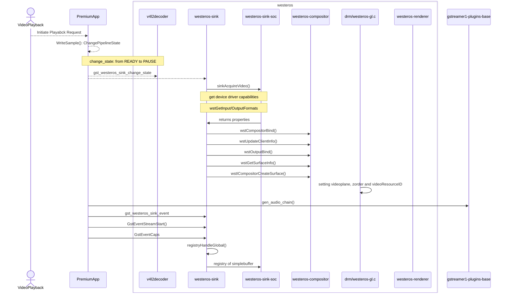

# Westeros Compositor

## Version History

| Date | Author | Comment | Version |
| --- | --------- | --- | --- |
| 27/06/23 | Premium App Team | First Release | 1.0.0 |
| 23/05/23 | Review Team | First Edit | 0.1.1 |
| 08/05/23 | Premium App Team | Pre-Release | 0.1.0 |

## Table of Contents

- [Description](#description)
  - [Introduction](#introduction)
  - [Repo Details](#repo-details)
  - [Acronyms, Terms and Abbreviations](#acronyms-terms-and-abbreviations)
  - [References](#references)
- [Component Runtime Execution Requirements](#component-runtime-execution-requirements)
  - [Initialization and Startup](#initializatio-and-startup)
  - [Threading Model](#threading-model)
  - [Process Model](#process-model)
  - [Memory Model](#memory-model)
  - [Power Management Requirements](#power-management-requirements)
  - [Asynchronous Notification Model](#asynchronous-notification-model)
  - [Blocking calls](#blocking-calls)
  - [Internal Error Handling](#internal-error-handling)
  - [Persistence Model](#persistence-model)
- [Non-functional requirements](#non-functional-requirements)
  - [Logging and debugging requirements](#logging-and-debugging-requirements)
  - [Memory and performance requirements](#memory-and-performance-requirements)
  - [Quality Control](#quality-control)
  - [Licensing](#licensing)
  - [Build Requirements](#build-requirements)
  - [Variability Management](#variability-management)
  - [Platform or Product Customization](#platform-or-product-customization)
- [Interface API Documentation](#interface-api-documentation)
  - [Theory of operation and key concepts](#theory-of-operation-and-key-concepts)
  - [Diagrams](#diagrams)
  - [Data Structures and Defines](#data-structures-and-defines)

## Description

### Introduction

The Westeros Compositor is responsible for managing the display of graphical content on the screen. It takes the output from Wayland clients, which can include windows, applications, and other graphical elements, and composes them into a single image that is displayed on the screen. The compositor can also perform tasks such as scaling, rotation, and alpha blending to create visually appealing and responsive user interfaces.

### Repo Details
| Module  | RDK repo | Filepath/Filename  |
| --- | --- | --- |
| Westeros compositor | https://code.rdkcentral.com/r/admin/repos/components/opensource/westeros | file: westeros-compositor.h |

### Acronyms, Terms and Abbreviations

- `HAL`    - Hardware Abstraction Layer
- `API`    - Application Programming Interface
- `Wst`    - Westeros
- `SoC`    - System on Chip
- `EOS`    - End-of-stream

### References
[Westeros - RDK - RDK Central Wiki](https://wiki.rdkcentral.com/display/RDK/Westeros) \n
[RDK Video Documentation- Westeros](https://developer.rdkcentral.com/documentation/documentation/rdk_video_documentation/rdk-v_components/rdk-v_open-sourced_components/westeros/) \n

## Component Runtime Execution Requirements
The Westeros compositor is responsible responsible for managing the display of graphical content on the system and for displaying video frames on the screen. It does this by creating a surface for each video frame and then submitting the surface to the display. The display then renders the surface to the screen. In order to support video playback, the Westeros compositor must meet the following runtime execution requirements:

- The compositor must be registered and initialized with the system before video playback begins.
- The westeros-sink module must be used to display the video, and must be configured to use the Westeros compositor as its backend.
- The client application must connect to the Westeros compositor in order to display the video content on the screen.
- The compositor must provide a surface for the client to display the video content on.
- The compositor must be capable of handling the video content, including decoding and rendering the frames.
- The client application should successfully connect to the compositor and that a surface is created for the video content.

please note: during runtime, Westeros compositor requires the following runtime environment:
1. A Linux operating system
2. A graphics card with a supported driver
3. A display that supports the desired video resolution

### Initialization and Startup
Create a new compositor instance with WstCompositorCreate(). The caller should configure the instance with WstCompositorSet\* calls and then start the compositor operation by calling WstCompositorStart().

### Threading Model
This interface is not required to be thread safe. Any functions invoking these `APIs` should ensure calls are made in a thread safe manner.

### Process Model
The Westeros compositor is a multi-process compositor. During video playback, the media player creates the Westeros compositor when it needs to start playing a video, and remains running until the media player completely stops playing video. The Westeros-compositor is able to handle multiple compositor instances simultaneously.

### Memory Model
The Westeros compositor is executed as a user-space process. The compositor communicates with the media player through a set of shared memory regions. The media player writes video frames to these shared memory regions, and the compositor reads the video frames from these shared memory regions and displays them on the screen.

### Power Management Requirements
Although this interface is not required to be involved in any of the power management operations, the state transitions must not affect its operation. e.g. on resumption from a low power state, the interface should operate as if no transition has occurred. This is not a resource-intensive component. It does not need to maintain any state between instantiations. It is stateless, so it can be created and destroyed multiple times without any problems. If multiple processes need to display video, they can each create their own instance of the Westeros compositor. This will ensure that each process has its own independent view of the video. However, it is important to note that this will also increase the memory and CPU usage of the system.

### Asynchronous Notification Model
Five callback functions:- WstCompositorSetTerminatedCallback, WstCompositorSetDispatchCallback, WstCompositorSetInvalidateCallback, WstCompositorSetHidePointerCallback and WstCompositorSetClientStatusCallback. 

### Blocking calls
Westeros Compositor API does not contain any blocking calls by itself, though if an application uses the Westeros Compositor API to create a multithreaded application that uses blocking calls or waits on locks, the application may block until the blocking call or lock is released. 
It is recommended to use non-blocking APIs or to use asynchronous programming techniques such as callbacks or event-driven programming to ensure optimal performance.

### Internal Error Handling
All the `APIs` must return error synchronously as a return argument. `HAL` is responsible for handling system errors (e.g. out of memory) internally.
WstCompositorGetLastErrorDetail() returns a null terminated string giving information about the last error that has occurred.

### Persistence Model
There is no requirement for the interface to persist any setting information. Westeros Compositor API does not provide a built-in persistence model, it is possible to implement a persistence model using the GStreamer framework and other tools and libraries (like a configuration file format such as JSON or XML ) to save and load the configuration of the compositor.

## Non-functional requirements

### Logging and debugging requirements
This component is required to support DEBUG, INFO and ERROR messages. DEBUG should be disabled by default and enabled when required. It should log its activity to the system log. The log messages provide information about the video frames that are being displayed, as well as any errors that occur during video playback. The log messages may also include timestamps and other relevant information to aid in troubleshooting.

### Memory and performance requirements
This interface is required to not cause excessive memory and CPU utilization. The memory and performance requirements when designing and deploying video processing applications that use the Westeros Compositor should be appropriately considered to handle high-bitrate, size & complexity of video streams, output resolution and format.

### Quality Control

- This interface is required to perform static analysis, our preferred tool is Coverity.
- Open-source copyright validation is required to be performed, e.g.: Black duck, FossID.
- Have a zero-warning policy with regards to compiling. All warnings are required to be treated as errors.
- Use of memory analysis tools like Valgrind are encouraged, to identify leaks/corruptions.
- Tests will endeavour to create worst case scenarios to assist investigations.

### Licensing
The `HAL` implementation is released under the Apache License 2.0.

### Build Requirements
The source code must build into a shared library(libwesteros_compositor.so). The build requirements for the Westeros Compositor include the GStreamer framework, OpenGL ES 2.0 or later, EGL, DRM, and Wayland. In addition, a set of build tools and libraries are required (like make, gcc, and pkg-config, libdrm, libwayland-client, libwayland-server, and others). The specific requirements may vary depending on the hardware platform and environment being used. (note: The Westeros Compositor is a video compositor and does not require a physical display output.)

### Variability Management
Any changes in the `APIs` should be reviewed and approved by the component architects.

### Platform or Product Customization
No product customization is expected from SoC vendors from this module. Although static functions can be created for implementation purposes.

## Interface API Documentation
`API` documentation will be provided by Doxygen which will be generated from the header files.

### Theory of operation and key concepts
There are 56 API's related to Westeros Compositor modules. In this we have 5 callback functions.
The compositor is registered and initialized with the system, and the westeros-sink module is using the compositor as its backend for video playback. Additionally, the logs should show that the client application is successfully connecting to the compositor and that a surface is created for the video content. 
During pre-playback itself, westeros-compositor gets initiated. WstCompositorStart() starts the wstCompositorCreateRenderer() function which further calls WstRendererCreate() in order to initialize renderer module. wstCompositorBind() binds the compositor with the client application, updates the client info and post gettig client's credentials it connects the display to the client's pid. Lastly surface is created for the client. Post app launch and after selecting a resource for playback, surface is allocated for respective pid.

### Diagrams

### Westeros-compositor during playback
It is written using Mermaid tool (Mermaid Live Editor at mermaid.live) which is a JavaScript based diagramming and charting tool that renders Markdown-inspired text definitions to create and modify diagrams dynamically. This following diagram can be directly renderered on this site: https://mermaid.live/.

### Data Structures and Defines
Refer the 'Files' sections: <a href="files.html">Files</a>
- SoC vendors should refer to the header files under the 'soc' directory for API implementation.
- For RDK level implementation refer to the header files under the 'rdk' directory.
