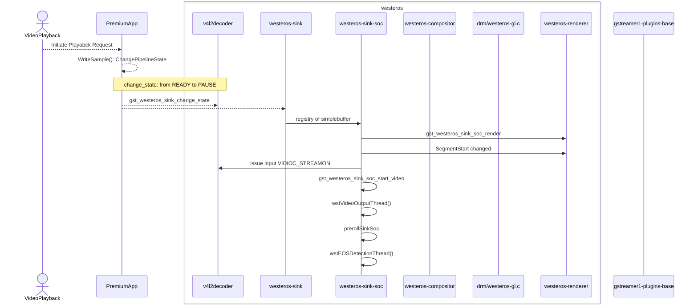

# Westeros Renderer

## Version History

| Date | Author | Comment | Version |
| --- | --------- | --- | --- |
| 27/06/23 | Premium App Team | First Release | 1.0.0 |
| 23/05/23 | Review Team | First Edit | 0.1.1 |
| 08/05/23 | Premium App Team | Pre-Release | 0.1.0 |

## Table of Contents

- [Description](#description)
  - [Introduction](#introduction)
  - [Repo Details](#repo-details)
  - [Acronyms, Terms and Abbreviations](#acronyms-terms-and-abbreviations)
  - [References](#references)
- [Component Runtime Execution Requirements](#component-runtime-execution-requirements)
  - [Initialization and Startup](#initializatio-and-startup)
  - [Threading Model](#threading-model)
  - [Process Model](#process-model)
  - [Memory Model](#memory-model)
  - [Power Management Requirements](#power-management-requirements)
  - [Asynchronous Notification Model](#asynchronous-notification-model)
  - [Blocking calls](#blocking-calls)
  - [Internal Error Handling](#internal-error-handling)
  - [Persistence Model](#persistence-model)
- [Non-functional requirements](#non-functional-requirements)
  - [Logging and debugging requirements](#logging-and-debugging-requirements)
  - [Memory and performance requirements](#memory-and-performance-requirements)
  - [Quality Control](#quality-control)
  - [Licensing](#licensing)
  - [Build Requirements](#build-requirements)
  - [Variability Management](#variability-management)
  - [Platform or Product Customization](#platform-or-product-customization)
- [Interface API Documentation](#interface-api-documentation)
  - [Theory of operation and key concepts](#theory-of-operation-and-key-concepts)
  - [Diagrams](#diagrams)
  - [Data Structures and Defines](#data-structures-and-defines)

## Description

### Introduction

The Westeros Renderer is responsible for rendering video and other multimedia content on the screen. It provides hardware-accelerated rendering of video content using graphics processing units (GPUs) and other specialized hardware, which allows for smooth and efficient playback of high-definition video streams. 

### Repo Details
| Module  | RDK repo | Filepath/Filename  |
| --- | --- | --- |
| Westeros Renderer | https://code.rdkcentral.com/r/admin/repos/components/opensource/westeros | files: westeros-render.h |

### Acronyms, Terms and Abbreviations

- `HAL`    - Hardware Abstraction Layer
- `API`    - Application Programming Interface
- `Wst`    - Westeros
- `SoC`    - System on Chip
- `EOS`    - End-of-stream

### References
[Westeros - RDK - RDK Central Wiki](https://wiki.rdkcentral.com/display/RDK/Westeros) \n
[RDK Video Documentation- Westeros](https://developer.rdkcentral.com/documentation/documentation/rdk_video_documentation/rdk-v_components/rdk-v_open-sourced_components/westeros/) \n

## Component Runtime Execution Requirements
To use the Westeros Renderer for video playback, it is necessary to ensure that the runtime execution requirements like having the appropriate operating system, graphics card, processor, and memory requirements are met. The video playback logs must contain information about the video playback, including the video resolution, frame rate, and audio format. The logs should also include information about any errors or warnings that occurred during playback.

### Initialization and Startup
WstRendererCreate() function creates a new WstRenderer object and takes several input parameters, including a module name, command line arguments, a Wayland display, and a nested connection object. The command line arguments are parsed to retrieve the width and height values of the output window (and a native window if it is available). The function needs to allocate memory for a new WstRenderer object and sets its properties based on the input parameters, including the Wayland display and the nested connection object. An internal function like wstCompositorCreateRenderer() from westeros-compositor can call WstRendererCreate() in order to initialize renderer module. 

### Threading Model
This interface is not required to be thread safe. Any functions invoking these `APIs` should ensure calls are made in a thread safe manner.

### Process Model
The process model in the Westeros Renderer API provides a flexible and efficient way to manage the video stream processing and rendering tasks. The multi-process architecture, plugin-based architecture, process isolation, and load balancing features help to optimize performance, stability, and resource usage. It is important to carefully manage the process model when developing applications that use the Westeros Renderer API to ensure optimal performance and stability.

### Memory Model
The Westeros Renderer API supports buffer sharing between different processes and devices using the Linux DMA-BUF mechanism. This allows multiple processes or devices to share the same buffer pool, reducing the overall memory usage and increasing efficiency. WstRendererQueryDmabufFormats and WstRendererQueryDmabufModifiers queries the list of supported DMA-BUF buffer formats and available modifiers for a given DMABUF format by the renderer. WstRendererSurfaceDestroy will do any necessary cleanup operations to free up resources associated with the surface, such as releasing graphics buffers or deleting the surface from the list of surfaces maintained by the renderer. 
Registry of simplebuffer happens during playback from westeros-sink.

### Power Management Requirements
Although this interface is not required to be involved in any of the power management operations, the state transitions should not affect its operation. The power management requirements in the Westeros Renderer API are designed to minimize power consumption and optimize performance.

### Asynchronous Notification Model
These APIs in the Westeros Renderer can provide a way for applications to receive notifications about events and state changes without blocking the main thread of execution, and can be useful in scenarios where the application needs to respond to events or state changes in a timely and efficient manner. Callback functions can be implemented for such conditions as the existing list does not have any.

### Blocking calls
Most of the functions in the Westeros Renderer API are non-blocking, meaning that they return control to the application immediately and do not block the application's main thread of execution.

### Internal Error Handling
Error handling should be robust and configurable to ensure timely and accurate reporting of errors and exceptions. All the `APIs` must return error synchronously as a return argument. The error messages may include relevant information, such as error codes and stack traces, to aid in troubleshooting. `HAL` is responsible for handling system errors (e.g. out of memory) internally.

### Persistence Model
There is no requirement for the interface to persist any setting information.

## Non-functional requirements

### Logging and debugging requirements
This component is required to support DEBUG, INFO and ERROR messages. DEBUG should be disabled by default and enabled when required. The logging should allow for detailed and configurable logging of internal operations, while debugging should support inspection of internal state and operations. The log messages may also include timestamps and other relevant information to aid in troubleshooting.

### Memory and performance requirements
This interface is required to not cause excessive memory and CPU utilization. The memory and performance requirements when designing and deploying video processing applications that use the Westeros Compositor should be appropriately considered to handle high-bitrate, size & complexity of video streams, output resolution and format.

### Quality Control

- This interface is required to perform static analysis, our preferred tool is Coverity.
- Open-source copyright validation is required to be performed, e.g.: Black duck, FossID.
- Have a zero-warning policy with regards to compiling. All warnings are required to be treated as errors.
- Use of memory analysis tools like Valgrind are encouraged, to identify leaks/corruptions.
- Tests will endeavour to create worst case scenarios to assist investigations.

### Licensing
The `HAL` implementation is released under the Apache License 2.0.

### Build Requirements
The source code must build into a shared library(libwesteros_render_gl.so or libwesteros_render_embedded.so). The build requirements for the Westeros Compositor include the GStreamer framework, OpenGL ES 2.0 or later, EGL, DRM, and Wayland. In addition, a set of build tools and libraries are required (like make, gcc, and pkg-config, libdrm, libwayland-client, libwayland-server, and others). The specific requirements may vary depending on the hardware platform and environment being used. (note: The Westeros Renderer is a video renderer and requires a physical display output.)

### Variability Management
Any changes in the `APIs` should be reviewed and approved by the component architects.

### Platform or Product Customization
No product customization is expected from SoC vendors from this module. Although static functions can be created for implementation purposes.

## Interface API Documentation

`API` documentation will be provided by Doxygen which will be generated from the header files.

### Theory of operation and key concepts
The caller is expected to have complete control over the life cycle of the `HAL`.

- With WstRendererCreate(), function creates a new WstRenderer object and takes several input parameters, including a module name, command line arguments, a Wayland display, and a nested connection object. 
- WstRendererUpdateScene() function updates the current scene of the renderer.
- Functions related to WstRendererSurface\* are expected to takes care of the rendering surface and its properties for a given renderer by adhering to the expected 'parameters' and 'return types'. There are 12 functions coming in this category.
- WstRendererQueryDmabuf\* related functions queries the list of supported DMA-BUF buffer formats by the renderer or queries the available modifiers for a given DMABUF format from a renderer. 
- WstRendererResolutionChange\* functions notify the renderer that a resolution change is about to occur or end.
- WstRendererDelegateUpdateScene() function needs to update the scene using the provided renderer's delegate function.
- In the end WstRendererDestroy() cleans up and destroys a WstRenderer object by terminating the rendering process and freeing the allocated memory.

### Diagrams

### Westeros-renderer during playback
It is written using Mermaid tool (Mermaid Live Editor at mermaid.live) which is a JavaScript based diagramming and charting tool that renders Markdown-inspired text definitions to create and modify diagrams dynamically. This following diagram can be directly renderered on this site: https://mermaid.live/.

### Data Structures and Defines
Refer the 'Files' sections: <a href="files.html">Files</a>
- SoC vendors should refer to the header files under the 'soc' directory for API implementation.
- For RDK level implementation refer to the header files under the 'rdk' directory.

