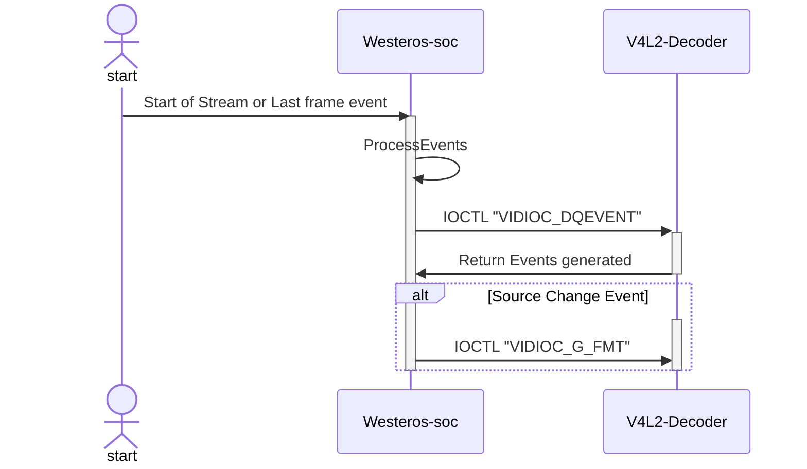

# Westeros-Sink-Soc

## Version History

| Date | Author | Comment | Version |
| --- | --------- | --- | --- |
| 27/06/23 | Premium App Team | First Release | 1.0.0 |
| 23/05/23 | Review Team | First Edit | 0.1.1 |
| 08/05/23 | Premium App Team | Pre-Release | 0.1.0 |

## Table of Contents

- [Description](#description)
  - [Introduction](#introduction)
  - [Repo Details](#repo-details)
  - [Events exposed](#events-exposed)
  - [V4L2 IOCTL for SOC Implementation](#v4l2-ioctl-for-soc-implementation)
  - [Acronyms, Terms and Abbreviations](#acronyms-terms-and-abbreviations)
  - [References](#references)
- [Component Runtime Execution Requirements](#component-runtime-execution-requirements)
  - [Initialization and Startup](#initializatio-and-startup)
  - [Threading Model](#threading-model)
  - [Process Model](#process-model)
  - [Memory Model](#memory-model)
  - [Power Management Requirements](#power-management-requirements)
  - [Asynchronous Notification Model](#asynchronous-notification-model)
  - [Blocking calls](#blocking-calls)
  - [Internal Error Handling](#internal-error-handling)
  - [Persistence Model](#persistence-model)
- [Non-functional requirements](#non-functional-requirements)
  - [Logging and debugging requirements](#logging-and-debugging-requirements)
  - [Memory and performance requirements](#memory-and-performance-requirements)
  - [Quality Control](#quality-control)
  - [Licensing](#licensing)
  - [Build Requirements](#build-requirements)
  - [Variability Management](#variability-management)
  - [Platform or Product Customization](#platform-or-product-customization)
- [Interface API Documentation](#interface-api-documentation)
  - [Theory of operation and key concepts](#theory-of-operation-and-key-concepts)
  - [Diagrams](#diagrams)
    - [V4L2 IOCTL Code flow](#v4l2-ioctl-code-flow)
  - [Data Structures and Defines](#data-structures-and-defines)

## Description

### Introduction

The Westeros Sink Soc module is a component of the Westeros project that is designed to work with various soc platforms. It provides a mechanism for rendering and displaying multimedia content on the target device. It is responsible for interacting with the display hardware on the SoC platform, using the Direct Rendering Manager (DRM) module to access the graphics and multimedia resources. It provides a mechanism for displaying graphical content and video streams, and also handles audio output through the audio subsystem on the target device. 

### Repo Details
| Module  | RDK repo | Filepath/Filename  |
| --- | --- | --- |
| Westeros-sink-soc | https://code.rdkcentral.com/r/admin/repos/components/opensource/westeros | path: westeros-sink/v4l2 \n file: westeros-sink-soc.c |

### Events exposed

| Sl. no.  | Signal     | Event    | Description    | Signal Emit Function Name     | Signal Emit Conditions   | How to use this \n signal from Application |                       
| -------- | ---------- | -------- | ------------- | ----------------------------- | ------------------------ | ------------------- |
| 1   | SIGNAL_FIRSTFRAME   | first-video-frame-callback| The signal emitted by this API, will be emitted when the first video frame is ready and available for processing.| gst_westeros_sink_soc_render,	gst_westeros_sink_soc_start_video, gst_westeros_sink_soc_init | 1. when gst_westeros_sink_soc_init() is called, sink calls on display function, with that to generate first frame thread it checks if sink is not NULL, the signal is called. \n 2. when the gst_westeros_sink_soc_start_video() is called, with the capture_start event, a no. of functions are called to check condition and collect data related to buffer, plane and getting frame related data like frame rate, frame size, frame width, frame height, under this condtion: sink->soc.emitFirstFrameSignal is set to TRUE; signal is called. | g_signal_connect (decoder_instance, "first-video-frame-callback", G_CALLBACK(callback_fnc), Callback_fnc_data) |
| 2	| SIGNAL_UNDERFLOW	| buffer-underflow-callback	| The signal emitted by this API, will be emitted when there is a buffer underflow condition in the element. A buffer underflow occurs when the element is unable to produce or process data quickly enough to keep up with the data flow rate, resulting in a depletion of the buffer. When it happens, this signal is emitted.	| gst_westeros_sink_soc_start_video, gst_westeros_sink_soc_render. |	1. when the gst_westeros_sink_soc_start_video() is called, with the capture_start event, a no. of functions is called to check condition and collect data related to buffer, plane and getting frame related data like frame rate, frame size, frame width, frame height, under this condtion: sink->soc.emitUnderflowSignal is set to TRUE; signal is called.	| g_signal_connect (decoder_instance, "buffer-underflow-callback", G_CALLBACK(callback_fnc), Callback_fnc_data) |
| 3   | SIGNAL_NEWTEXTURE   | new-video-texture-callback| The signal emitted by this API, will be emitted when a new video texture is ready and available for processing. The callback function associated with this signal may need to parse and interpret the various arguments in order to properly process the new video texture data related to the video texture format, dimensions, and planes.	| gst_westeros_sink_soc_start_video, gst_westeros_sink_soc_render, gst_westeros_sink_soc_init	| 1. This signal is emitted when a new texture is ready to be displayed by the video sink. Various parameters are passed based on whether the texture is multi-planar or not and sets the appropriate values for the file descriptor, length, stride, and pointer of each plane of the texture buffer. \n 2. It can also be emitted when westeros_sink_dispatch event come into play and sink->soc.enableTextureSignal is called.| g_signal_connect (decoder_instance, "new-video-texture-callback", G_CALLBACK(callback_fnc), Callback_fnc_data) |
| 4	| SIGNAL_DECODEiERROR	| decode-error-callback	| The signal emitted by this API, will be emitted when there is a decoding error in the element. A decoding error occurs when the element is unable to decode the input data stream properly, resulting in a failure to produce valid output data. When this happens, this signal is emitted. |	| 1. This signal can be emitted under the conditions where if the video decoder captures any error related to video decoding status and any respective flag is set, this signal can be generated and to further handle the decode errors.	| g_signal_connect (decoder_instance, "decode-error-callback", G_CALLBACK(callback_fnc), Callback_fnc_data) |
| 5	| SIGNAL_TIMECODE	| timecode-callback	| The signal emitted by this API, will be emitted when a new timecode is available. It is used to indicate the current timecode of the media being processed by the element which can be helpful in synchronizing multiple elements.	| gst_westeros_sink_soc_start_video, gst_westeros_sink_soc_render | 1. This signal can be emitted under the condition that if a set position from frame currently is being presented by the video server \n 2. This signal can be emitted under another condition that if any video status message is received from the video server related to if timecode is present where the message may contain the presentation timestamp of frames being displayed, this information can help to process mesaages in video syncronisation or video client connection. | g_signal_connect (decoder_instance, "timecode-callback", G_CALLBACK(callback_fnc), Callback_fnc_data) |

### V4L2 IOCTL for SOC Implementation

| Sl. no.  | IOCTL Call        | About                | Description              | Synopsis                     | IOCTL Definition file |
| -------- | ----------------- | -------------------- | ------------------------ | ---------------------------- | --------------------- |
| 1	| VIDIOC_QUERYCAP | Query device capabilities	| All V4L2 devices support the VIDIOC_QUERYCAP ioctl. It is used to identify kernel devices compatible with this specification and to obtain information about driver and hardware capabilities. The ioctl takes a pointer to a struct v4l2_capability which is filled by the driver. When the driver is not compatible with this specification the ioctl returns an EINVAL error code.	| https://www.kernel.org/doc/html/v4.8/media/uapi/v4l/vidioc-querycap.html#_CPPv25ioctliiP15v4l2_capability	| linux/videodev2.h |
| 2	| VIDIOC_ENUM_FMT	| Enumerate image formats	| To enumerate image formats applications initialize the type and index field of struct v4l2_fmtdesc and call the ioctl VIDIOC_ENUM_FMT ioctl with a pointer to this structure. Drivers fill the rest of the structure or return an EINVAL error code. All formats are enumerable by beginning at index zero and incrementing by one until EINVAL is returned.	| https://www.kernel.org/doc/html/v4.8/media/uapi/v4l/vidioc-enum-fmt.html	| linux/videodev2.h |
| 3	| VIDIOC_G_FMT	| Get the data format (typically image format) exchanged b/w driver & application.	| To query the current parameters applications set the type field of a struct struct v4l2_format to the respective buffer (stream) type. For example, video capture devices use V4L2_BUF_TYPE_VIDEO_CAPTURE or V4L2_BUF_TYPE_VIDEO_CAPTURE_MPLANE. When the application calls the VIDIOC_G_FMT ioctl with a pointer to this structure the driver fills the respective member of the fmt union. When the requested buffer type is not supported drivers return an EINVAL error code.	| https://www.kernel.org/doc/html/v4.8/media/uapi/v4l/vidioc-g-fmt.html	| linux/videodev2.h |
| 4	| VIDIOC_S_FMT	| Set the data format (typically image format) exchanged b/w driver & application	| When the application calls the VIDIOC_S_FMT ioctl with a pointer to a struct v4l2_format structure the driver checks and adjusts the parameters against hardware abilities. Drivers should not return an error code unless the type field is invalid, this is a mechanism to fathom device capabilities and to approach parameters acceptable for both the application and driver. On success the driver may program the hardware, allocate resources and generally prepare for data exchange. Finally, the VIDIOC_S_FMT ioctl returns the current format parameters as VIDIOC_G_FMT does. 	| https://www.kernel.org/doc/html/v4.8/media/uapi/v4l/vidioc-g-fmt.html	| linux/videodev2.h |
| 5	| VIDIOC_REQBUFS	| Initiate Memory Mapping | User Pointer I/O or DMA buffer I/O	To allocate device buffers applications initialize all fields of the struct v4l2_requestbuffers structure. They set the type field to the respective stream or buffer type, the count field to the desired number of buffers, memory must be set to the requested I/O method and the reserved array must be zeroed. When the ioctl is called with a pointer to this structure the driver will attempt to allocate the requested number of buffers and it stores the actual number allocated in the count field. For example, video output requires at least two buffers, one displayed and one filled by the application. When the I/O method is not supported the ioctl returns an EINVAL error code.	| https://www.kernel.org/doc/html/v4.8/media/uapi/v4l/vidioc-reqbufs.html	| linux/videodev2.h |
| 6	| VIDIOC_QUERYBUF	| Query the status of a buffer.	| Applications set the type field of a struct v4l2_buffer to the same buffer type as was previously used with struct v4l2_format type and struct v4l2_requestbuffers type, and the index field. Valid index numbers range from zero to the number of buffers allocated with ioctl VIDIOC_REQBUFS (struct v4l2_requestbuffers count) minus one. The reserved and reserved2 fields must be set to 0. After calling ioctl VIDIOC_QUERYBUF with a pointer to this structure drivers return an error code or fill the rest of the structure.	| https://www.kernel.org/doc/html/v4.8/media/uapi/v4l/vidioc-querybuf.html	| linux/videodev2.h |
| 7	| VIDIOC_G_FBUF	| Get frame buffer overlay parameters.	| To get the current parameters applications call the VIDIOC_G_FBUF ioctl with a pointer to a struct v4l2_framebuffer structure. The driver fills all fields of the structure or returns an EINVAL error code when overlays are not supported.	| https://www.kernel.org/doc/html/v4.8/media/uapi/v4l/vidioc-g-fbuf.html	| linux/videodev2.h |
| 8	| VIDIOC_S_FBUF	| Set frame buffer overlay parameters.	| To set the parameters for a Video Output Overlay, applications must initialize the flags field of a struct struct v4l2_framebuffer. Since the framebuffer is implemented on the TV card all other parameters are determined by the driver. When an application calls VIDIOC_S_FBUF with a pointer to this structure, the driver prepares for the overlay and returns the framebuffer parameters as VIDIOC_G_FBUF does, or it returns an error code. \n To set the parameters for a non-destructive Video Overlay, applications must initialize the flags field, the fmt substructure, and call VIDIOC_S_FBUF. \n For a destructive Video Overlay applications must additionally provide a base address. | https://www.kernel.org/doc/html/v4.8/media/uapi/v4l/vidioc-g-fbuf.html	| linux/videodev2.h|
| 9	| VIDIOC_OVERLAY	| Start or stop video overlay	| This ioctl is part of the video overlay I/O method. Applications call ioctl VIDIOC_OVERLAY to start or stop the overlay. It takes a pointer to an integer which must be set to zero by the application to stop overlay, to one to start. Drivers do not support ioctl VIDIOC_STREAMON, VIDIOC_STREAMOFF or VIDIOC_STREAMOFF with V4L2_BUF_TYPE_VIDEO_OVERLAY.  | https://www.kernel.org/doc/html/v4.8/media/uapi/v4l/vidioc-overlay.html	| linux/videodev2.h |
| 10	| VIDIOC_QBUF	| Exchange a buffer with the driver	| Applications call the VIDIOC_QBUF ioctl to enqueue an empty (capturing) or filled (output) buffer in the driver’s incoming queue. The semantics depend on the selected I/O method. \n To enqueue a memory mapped buffer applications set the memory field to V4L2_MEMORY_MMAP. When VIDIOC_QBUF is called with a pointer to this structure the driver sets the V4L2_BUF_FLAG_MAPPED and V4L2_BUF_FLAG_QUEUED flags and clears the V4L2_BUF_FLAG_DONE flag in the flags field, or it returns an EINVAL error code. \n To enqueue a user pointer buffer applications set the memory field to V4L2_MEMORY_USERPTR, the m.userptr field to the address of the buffer and length to its size. To enqueue a DMABUF buffer applications set the memory field to V4L2_MEMORY_DMABUF & m.fd field to file descriptor associated with a DMABUF buffer. | https://www.kernel.org/doc/html/v4.8/media/uapi/v4l/vidioc-qbuf.html	| linux/videodev2.h |
| 11	| VIDIOC_EXPBUF	| Export a buffer as a DMABUF file descriptor	| This ioctl is an extension to the memory mapping I/O method, hence it is available only for V4L2_MEMORY_MMAP buffers. To export a buffer, applications fill struct v4l2_exportbuffer. The type field is set to the same buffer type as was previously used with struct v4l2_requestbuffers type. Applications must also set the index field. Valid index numbers range from zero to the number of buffers allocated with ioctl VIDIOC_REQBUFS (struct v4l2_requestbuffers count) minus one. Additional flags may be posted in the flags field. After calling ioctl VIDIOC_EXPBUF the fd field will be set by a driver. | https://www.kernel.org/doc/html/v4.8/media/uapi/v4l/vidioc-expbuf.html	| linux/videodev2.h |
| 12	| VIDIOC_DQBUF	| Exchange a buffer with the driver	| Applications call the VIDIOC_DQBUF ioctl to dequeue a filled (capturing) or displayed (output) buffer from the driver’s outgoing queue. They just set the type, memory and reserved fields of a struct v4l2_buffer as above, when VIDIOC_DQBUF is called with a pointer to this structure the driver fills the remaining fields or returns an error code. The driver may also set V4L2_BUF_FLAG_ERROR in the flags field. By default, VIDIOC_DQBUF blocks when no buffer is in the outgoing queue. | https://www.kernel.org/doc/html/v4.8/media/uapi/v4l/vidioc-qbuf.html	| linux/videodev2.h  |
| 13	| VIDIOC_STREAMON	| Start streaming I/O	| This ioctl start the capture or output process during streaming (memory mapping, user pointer or DMABUF) I/O. \n Capture hardware is disabled and no input buffers are filled (if there are any empty buffers in the incoming queue) until VIDIOC_STREAMON has been called. Output hardware is disabled and no video signal is produced until VIDIOC_STREAMON has been called. The ioctl will succeed when at least one output buffer is in the incoming queue. Memory-to-memory devices will not start until VIDIOC_STREAMON has been called for both the capture and output stream types. \n If VIDIOC_STREAMON fails, then any already queued buffers will remain queued. | https://www.kernel.org/doc/html/v4.8/media/uapi/v4l/vidioc-streamon.html	| linux/videodev2.h |
| 14	| VIDIOC_STREAMOFF	| Stop streaming I/O	| The VIDIOC_STREAMOFF ioctl, apart from aborting or finishing any DMA in progress, unlocks any user pointer buffers locked in physical memory, and it removes all buffers from the incoming and outgoing queues. That means all images captured but not dequeued yet will be lost, likewise all images enqueued for output but not transmitted yet. I/O returns to the same state as after calling ioctl VIDIOC_REQBUFS and can be restarted accordingly.| https://www.kernel.org/doc/html/v4.8/media/uapi/v4l/vidioc-streamon.html	| linux/videodev2.h |
| 15	| VIDIOC_G_PARM	| Get streaming parameters.	| The current video standard determines a nominal number of frames per second. If less than this number of frames is to be captured or output, applications can request frame skipping or duplicating on the driver side. This is especially useful when using the read() or write(), which are not augmented by timestamps or sequence counters, and to avoid unnecessary data copying. Further get/set can be used to determine the number of buffers used internally by a driver in read/write mode. For implications see the section discussing the read() function. \n To get the streaming parameters applications call the VIDIOC_G_PARM ioctl. It takes a pointer to a struct struct v4l2_streamparm which contains a union holding separate parameters for input and output devices. | https://www.kernel.org/doc/html/v4.8/media/uapi/v4l/vidioc-g-parm.html	| linux/videodev2.h |
| 16	| VIDIOC_S_PARM	| Set streaming parameters.	| To set the streaming parameters applications call the VIDIOC_S_PARM ioctl. It takes a pointer to a struct struct v4l2_streamparm which contains a union holding separate parameters for input and output devices.| https://www.kernel.org/doc/html/v4.8/media/uapi/v4l/vidioc-g-parm.html	| linux/videodev2.h |
| 17	| VIDIOC_G_STD	| Query the video standard of the current input	| It takes a pointer to a v4l2_std_id type as argument. VIDIOC_G_STD can return a single flag or a set of flags as in struct v4l2_standard field id. The flags must be unambiguous such that they appear in only one enumerated struct v4l2_standard structure.| https://www.kernel.org/doc/html/v4.8/media/uapi/v4l/vidioc-g-std.html	| linux/videodev2.h | 
| 18	| VIDIOC_S_STD	| Select the video standard of the current input.	| It takes a pointer to a v4l2_std_id type as argument. VIDIOC_G_STD can return a single flag or a set of flags as in struct v4l2_standard field id. The flags must be unambiguous such that they appear in only one enumerated struct v4l2_standard structure. \n VIDIOC_S_STD accepts one or more flags, being a write-only ioctl it does not return the actual new standard as VIDIOC_G_STD does. | https://www.kernel.org/doc/html/v4.8/media/uapi/v4l/vidioc-g-std.html	| linux/videodev2.h |
| 19	| VIDIOC_ENUMSTD	| Enumerate supported video standards	| To query the attributes of a video standard, especially a custom (driver defined) one, applications initialize the index field of struct v4l2_standard and call the ioctl VIDIOC_ENUMSTD ioctl with a pointer to this structure. Drivers fill the rest of the structure or return an EINVAL error code when the index is out of bounds. To enumerate all standards applications shall begin at index zero, incrementing by one until the driver returns EINVAL. Drivers may enumerate a different set of standards after switching the video input or output.	| https://www.kernel.org/doc/html/v4.8/media/uapi/v4l/vidioc-enumstd.html	| linux/videodev2.h | 
| 20	| VIDIOC_ENUMINPUT	| Enumerate video inputs	| To query the attributes of a video input applications initialize the index field of struct v4l2_input and call the ioctl VIDIOC_ENUMINPUT ioctl with a pointer to this structure. Drivers fill the rest of the structure or return an EINVAL error code when the index is out of bounds. To enumerate all inputs applications shall begin at index zero, incrementing by one until the driver returns EINVAL.	| https://www.kernel.org/doc/html/v4.8/media/uapi/v4l/vidioc-enuminput.html	| linux/videodev2.h |
| 21	| VIDIOC_G_CTRL	| Get the value of a control.	| To get the current value of a control applications initialize the id field of a struct struct v4l2_control and call the VIDIOC_G_CTRL ioctl with a pointer to this structure. Works only with user controls.	| https://www.kernel.org/doc/html/v4.8/media/uapi/v4l/vidioc-g-ctrl.html	| linux/videodev2.h | 
| 22	| VIDIOC_S_CTRL	| Set the value of a control.	| To change the value of a control applications, initialize the id and value fields of a struct struct v4l2_control and call the VIDIOC_S_CTRL ioctl. VIDIOC_S_CTRL is a write-only ioctl, it does not return the actual new value. Works only with user controls.	| https://www.kernel.org/doc/html/v4.8/media/uapi/v4l/vidioc-g-ctrl.html	| linux/videodev2.h |
| 23	| VIDIOC_QUERYCTRL	| Enumerate controls	| To query the attributes of a control applications set the id field of a struct v4l2_queryctrl and call the VIDIOC_QUERYCTRL ioctl with a pointer to this structure. The driver fills the rest of the structure or returns an EINVAL error code when the id is invalid. It is possible to enumerate controls by calling VIDIOC_QUERYCTRL with successive id values starting from V4L2_CID_BASE up to and exclusive V4L2_CID_LASTP1. Drivers may return EINVAL if control in this range is not supported.	| https://www.kernel.org/doc/html/v4.8/media/uapi/v4l/vidioc-queryctrl.html	| linux/videodev2.h |
| 24	| VIDIOC_ENUM_FRAMESIZES  | Enumerate frame sizes.	| This ioctl allows applications to enumerate all frame sizes (i. e. width and height in pixels) that the device supports for the given pixel format. The supported pixel formats can be obtained by using the ioctl VIDIOC_ENUM_FMT function. \n The return value and the content of the v4l2_frmsizeenum. type field depend on the type of frame sizes the device supports. When the application calls the function with index zero, it must check the type field to determine the type of frame size enumeration the device supports. | https://www.kernel.org/doc/html/v4.8/media/uapi/v4l/vidioc-enum-framesizes.html	| linux/videodev2.h |
| 25	| VIDIOC_TRY_FMT	| Try a data format.	| The VIDIOC_TRY_FMT ioctl is equivalent to VIDIOC_S_FMT with 1 exception: it does not change driver state. It can also be called at any time, never returning EBUSY. This function is provided to negotiate parameters, to learn about hardware limitations, without disabling I/O or possibly time-consuming hardware preparations. Although strongly recommended drivers are not required to implement this ioctl. The format as returned by VIDIOC_TRY_FMT must be identical to what VIDIOC_S_FMT returns for the same i/p or o/p. | https://www.kernel.org/doc/html/v4.8/media/uapi/v4l/vidioc-g-fmt.html	| linux/videodev2.h |
| 26	| VIDIOC_CROPCAP	| Information about the video cropping and scaling abilities	| Applications use this function to query the cropping limits, the pixel aspect of images and to calculate scale factors. They set the type field of a v4l2_cropcap structure to the respective buffer (stream) type and call the ioctl VIDIOC_CROPCAP ioctl with a pointer to this structure. Drivers fill the rest of the structure. The results are constant except when switching the video standard. Remember this switch can occur implicit when switching the video input or output.This ioctl must be implemented for video capture or output devices that support cropping and/or scaling and/or have non-square pixels, and for overlay devices.| https://www.kernel.org/doc/html/v4.8/media/uapi/v4l/vidioc-cropcap.html	| linux/videodev2.h |
| 27	| VIDIOC_CREATE_BUFS	| Create buffers for Memory Mapped or User Pointer or DMA Buffer I/O	| This can be used as an alternative or in addition to the ioctl VIDIOC_REQBUFS ioctl, when a tighter control over buffers is required. This ioctl can be called multiple times to create buffers of different sizes. To allocate the device buffers applications must initialize the relevant fields of the struct v4l2_create_buffers structure. The count field must be set to the number of requested buffers, the memory field specifies the requested I/O method and the reserved array must be zeroed. The format field specifies the image format that the buffers must be able to handle. \n When the ioctl is called with a pointer to this structure the driver will attempt to allocate up to the requested number of buffers and store the actual number allocated and the starting index in the count and the index fields respectively. On return count can be smaller than the number requested.| https://www.kernel.org/doc/html/v4.8/media/uapi/v4l/vidioc-create-bufs.html	| linux/videodev2.h |
| 28	| VIDIOC_G_SELECTION	| Get one of the selection rectangles.	| To query the cropping (composing) rectangle set struct v4l2_selection type field to the respective buffer type. Do not use the multiplanar buffer types. The next step is setting the value of struct v4l2_selection target field to V4L2_SEL_TGT_CROP (V4L2_SEL_TGT_COMPOSE). The flags and reserved fields of struct v4l2_selection is ignored, and they must be filled with zeros. The driver fills the rest of the structure or returns EINVAL error code if incorrect buffer type or target was used. If cropping (composing) is not supported, then the active rectangle is not mutable, and it is always equal to the bounds rectangle. Finally, the struct v4l2_rect r rectangle is filled with the current cropping (composing) coordinates. 	| https://www.kernel.org/doc/html/v4.8/media/uapi/v4l/vidioc-g-selection.html| linux/videodev2.h |

### Acronyms, Terms and Abbreviations

- `HAL`    - Hardware Abstraction Layer
- `API`    - Application Programming Interface
- `SoC`    - System on Chip
- `DRM`    - Direct Rendering Manager
- `V4L2`   - Video For Linux version 2
- `IOCTL`  - Input-Output Control
- `EOS`    - End-of-stream

### References
[Westeros - RDK - RDK Central Wiki](https://wiki.rdkcentral.com/display/RDK/Westeros) \n
[https://github.com/rdkcmf/westeros/blob/master/westeros-sink/westeros-sink.c](https://github.com/rdkcmf/westeros/blob/master/westeros-sink/westeros-sink.c) \n
[RDK Video Documentation- Westeros](https://developer.rdkcentral.com/documentation/documentation/rdk_video_documentation/rdk-v_components/rdk-v_open-sourced_components/westeros/) \n

## Component Runtime Execution Requirements
Minimum or no delay is expected during playback for uninterupted user experience. Any audio or video synchronization issues may result in a delayed audio or video, causing one to lag behind the other. This results in poor performance and not at all expected for any live playbacks. 

### Initialization and Startup
Westeros sink module is initialized via the gst_westeros_sink_class_init() when system boots up and the first home UI comes up. It then calls gst_westeros_sink_soc_class_init() and initializes the SoC part. When playback starts the state change event is received in westeros and it will acquire the audio and video decoders via the Essos resource manager. Since it is a wayland communication, a client and server will exist. The server is started from westeros-gl in the westeros-soc-drm module and client is established from the westeros-sink-soc.

### Threading Model
Only a single thread will be allocated resources at a time for rendering. A lock is acquired and until released pipeline will be in use by that particular thread.

### Process Model
This interface is required to support a single instantiation within a single process.

### Memory Model
While allocating resources for each pipeline, the device capabilities and its memory details are fetched. 
Video buffer is allocated only based on the device capability. When state change happens unused resources are released and de-allocated.

### Power Management Requirements
This interface is not required to be involved in any of the power management operations, the state transitions should not affect its operation.

### Asynchronous Notification Model
Westeros-sink-soc communicates with the V4L2 driver via the IOCTL commands.

### Blocking calls
Since we are using a socket communication, client and server listens for any incoming messages. Until it receives a message or an interupt happens, further code execution is blocked.

### Internal Error Handling
All the `APIs` must return error synchronously as a return argument. `HAL` is responsible for handling system errors (e.g. out of memory) internally.
decode-error-callback(this is an event and SIGNAL_DECODEERROR is the signal) is emitted when there is a decoding error in the element and EINVAL error code is returned for an V4L2 IOCTL error.

### Persistence Model
There is no requirement for the interface to persist any setting information.

## Non-functional requirements

### Logging and debugging requirements
The logging should be configurable to allow for different levels of detail. This interface is required to support DEBUG, INFO and ERROR messages. DEBUG should be disabled by default and enabled when required. Enable the ERROR log-level by default or INFO if required. The log messages may also include timestamps and other relevant information to aid in troubleshooting.

### Memory and performance requirements
This interface is required to not cause excessive memory and CPU utilization.

### Quality Control

- This interface is required to perform static analysis, our preferred tool is Coverity.
- Open-source copyright validation is required to be performed, e.g.: Black duck, FossID.
- Have a zero-warning policy with regards to compiling. All warnings are required to be treated as errors.
- Use of memory analysis tools like Valgrind are encouraged, to identify leaks/corruptions.
- Tests will endeavour to create worst case scenarios to assist investigations.

### Licensing
The `HAL` implementation is released under the Apache License 2.0.

### Build Requirements
The source code must be built into a shared library libgstwesterossink.so. 

### Variability Management
Any changes in the `APIs` should be reviewed and approved by the component architects.

### Platform or Product Customization
The underlying video driver varies with each SOC vendor and in the document, we are taking the V4L2 Linux driver as reference. Based on the driver, the system calls will also vary.

## Interface API Documentation
`API` documentation will be provided by Doxygen which will be generated from the header files.

### Theory of operation and key concepts
As system boots up westeros-gl will be responsible for creating the graphics UI. As per the Wayland communication protocol a server (Westeros Video Server) is initiated from the function wstInitServiceServer and it will wait for a client to be attached. Video data from gst pipeline is fed into the Westeros Sink module, and it will further be processed in the westeros-sink-soc module. The sink-soc module is responsible largely for communicating with the V4L2 driver over IOCTL commands. Sink-soc module also acts as the Westeros Video Client and communicates with the Video Server. During playback state change, westeros sink is responsible for handling the transitions. 

1. NULL to READY: During this time, westeros sink request Essos manager to allocates audio and video decoders and based on the priority and availability, decoders will be allocated. 
2. READY to PAUSED: Subscribe to source change and EOS events from the driver and a socket client is initiated for the selected app. 
3. PAUSED to PLAYING: Video states are updated to play from pause. 
4. PLAYING to PAUSED: During video pre-rolling data is queued in the buffer. Client and server server communicates over the socket. 
5. PAUSED to READY: Video client connection is terminated with a Shutdown command. 
6. READY to NULL: All resources are cleaned up.

### Diagrams

### V4L2 IOCTL Code flow
It is written using Mermaid tool (Mermaid Live Editor at mermaid.live) which is a JavaScript based diagramming and charting tool that renders Markdown-inspired text definitions to create and modify diagrams dynamically. This following diagram can be directly renderered on this site: https://mermaid.live/.

### Data Structures and Defines
Refer the 'Files' sections: <a href="files.html">Files</a>
- SoC vendors should refer to the header files under the 'soc' directory for API implementation.
- For RDK level implementation refer to the header files under the 'rdk' directory.

